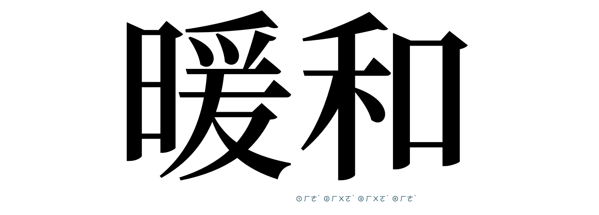

# Show CJK Pronunciation: Bopomofo/Zhuyin

# 顯示漢字的注音讀法

# 显示汉字的注音读法

- *Demo font: Noto Sans CJK SemiBold*

A [Glyphs.app](https://glyphsapp.com/) plugin to display the Mandarin phonetic symbols in Bopomofo (a.k.a. Zhuyin, 注音符號). It might help you to learn the pronunciation of some rare Chinese characters / Kanjis.

Noted that some pronunciations may not be recognized by the official education department. Depend on your IME, some pronunciation may not support.

Also, not all of Chinese characters' / Kanjis' pronunciation have been collected in this repo. For example, CJK unified ideographs extension area in Unicode may be missed.

--- 

讓你可以一邊做字，一邊學習你正在造的字怎麼念的小工具，尤其是那些罕用字。

請特別注意，部分讀音可能並不被官方的教育或正音單位所承認或收錄（意即並不被視為「標準讀法」）；且基於您所使用的輸入法之詞庫，也有可能因並未收錄該讀音，使其無法輸入該漢字。

此外，因為漢字數量實在太多了，如在 Unicode CJK 擴充區中的字符可能並未收錄於其中。

---

让你可以一边做字，一边学习你正在造的字怎么念的小工具，尤其是那些罕用字。

请特别注意，部分读音可能并不被官方的教育或正音单位所承认或收录（意即并不被视为「标准读法」）；且基于您所使用的输入法之词库，也有可能因并未收录该读音，使其无法输入该汉字。

此外，因为汉字数量实在太多了，如在 Unicode CJK 扩充区中的字符可能并未收录于其中。

## Installation

1. One-click install the plugin.
2. Restart Glyphs.
3. Click *View > Show CJK Pronunciation: Bopomofo/Zhuyin* to enable it.

## Requirements

The plug-in only test in Glyphs 3.1 (3133) & macOS Monterey (macOS 12). I can only test it in current app and OS versions, and perhaps it works on earlier and later versions too.

## License

Copyright 2023 ChingRu (@rutopio).

Based on sample code by Georg Seifert (@schriftgestalt) and Jan Gerner (@yanone).

Licensed under the Apache License, Version 2.0 (the "License"); you may not use this file except in compliance with the License. You may obtain a copy of the License at http://www.apache.org/licenses/LICENSE-2.0

See the License file included in this repository for further details.
